 <h1 align="center">夜桜 · Hi, I'm Lakshya Kumar</h1>

  <strong>Full Stack Developer · AI Engineer · Systems Builder</strong>

  Building scalable SaaS products, AI-powered applications, and high-performance systems.

  

  

  <a href="mailto:lakshyakumar0098@gmail.com">Email</a>
  &nbsp; · &nbsp;
  <a href="https://linkedin.com/in/Lakshyakumar266">LinkedIn</a>
  &nbsp; · &nbsp;
  <a href="https://github.com/Lakshyakumar266">GitHub</a>
  &nbsp; · &nbsp;
  <a href="https://hermesworkspace.com">HermesWorkspace</a>

---

## 01 · About Me

I'm a self-taught developer interested in building products from the ground up — from frontend interfaces and backend architecture to real-time infrastructure and AI integrations.

- **Building:** Scalable SaaS products and AI-powered applications.
- **Exploring:** Distributed systems, AI engineering, and cloud architecture.
- **Engineering:** Real-time communication, backend systems, and developer tooling.
- **Open to:** Interesting engineering problems and open-source collaboration.
- **Ask me about:** TypeScript, React, Next.js, React Native, Bun, Rust, backend engineering, and DevOps.
- **Reach me:** [lakshyakumar0098@gmail.com](mailto:lakshyakumar0098@gmail.com)

## 02 · Tech Stack

### Languages

  

### Frontend

  

### Mobile Development

  
  
  

### Backend & Runtime

  

### Databases & Data

  

### Cloud & DevOps

  

### AI / ML

  
  
  
  

### APIs & Real-Time Systems

  
  
  
  
  

### Developer Tools

  

---

## 03 · GitHub Analytics

  
  &nbsp;
  

  

<!-- Optional: uncomment to display the activity graph.

  

-->

<!-- Optional: uncomment to display GitHub trophies.

  

-->

---

## 04 · Core Technologies

  
  
  
  
  
  
  

## 05 · Connect

---

  <i>「 Build with intention. Ship with precision. 」</i>

  Thanks for stopping by. よろしくお願いします!

  <picture>
    <source media="(prefers-color-scheme: dark)" srcset="https://raw.githubusercontent.com/Lakshyakumar266/Lakshyakumar266/output/github-contribution-grid-snake-dark.svg" />
    
  </picture>

